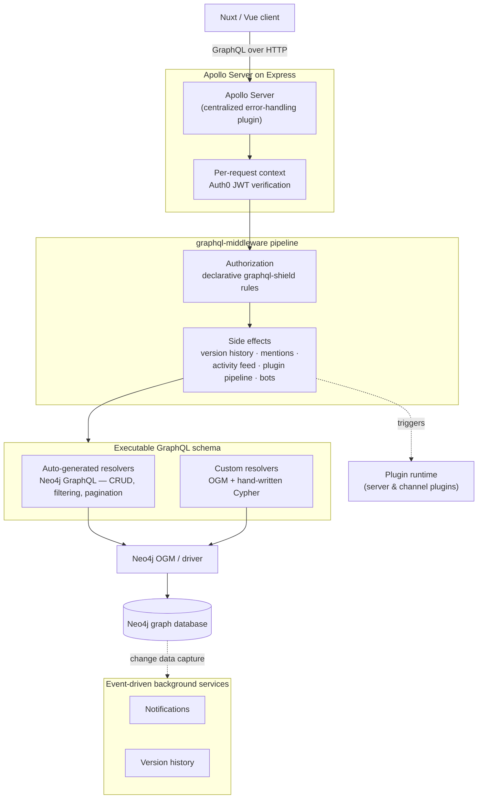

# Multiforum Backend

The GraphQL/Neo4j backend for Multiforum. The frontend lives in a separate
repository: [gennit-project/multiforum-nuxt](https://github.com/gennit-project/multiforum-nuxt).

📖 **Hosted documentation: [docs.multiforum.net](https://docs.multiforum.net/)** — product
docs and guides. This README and the [`docs/`](./docs) folder cover the backend
internals.

> Multiforum is under active development; test coverage is being expanded as core features stabilize.

## About

An [Apollo Server](https://www.apollographql.com/docs/apollo-server/) fetches data
from a [Neo4j](https://neo4j.com/) graph database. Some resolvers are
auto-generated using the [Neo4j GraphQL library](https://neo4j.com/docs/graphql/current/),
while more complex resolvers are implemented using a combination of the
[OGM](https://neo4j.com/docs/graphql/current/ogm/) and custom Cypher queries.

The frontend is a Nuxt/Vue application that makes GraphQL queries to this server.
For a full product overview, see the
[frontend README](https://github.com/gennit-project/multiforum-nuxt).

## Architecture

A request flows through distinct layers, each with a single responsibility —
transport, authentication, authorization, side effects, data resolution, and
storage:

**Why this stack.** A forum is a relationship-dense domain — threaded comments,
channel memberships, role hierarchies, votes, mentions, moderation actions. A
[graph database](https://neo4j.com/) models those relationships as first-class
edges, so questions like *"which mods govern this channel"* or *"the parent
chain of this comment"* are traversals rather than multi-table joins. The
[Neo4j GraphQL library](https://neo4j.com/docs/graphql/current/) derives most of
the API — typed CRUD, filtering, and nested relationship resolution — directly
from the schema, which reserves hand-written code for genuinely custom logic
(custom Cypher, transactions, cross-entity workflows). [GraphQL](https://graphql.org/)
gives clients precise, typed data fetching against a single schema contract, and
those types flow end-to-end into TypeScript via code generation.

**Separation of concerns.** Authorization is expressed as composable
[graphql-shield](https://www.npmjs.com/package/graphql-shield) rules applied as a
middleware layer, kept out of resolver logic. Cross-cutting side effects —
version history, @-mentions, activity feeds, plugin pipelines — are isolated in
their own middleware, and asynchronous work (notifications, version snapshots)
runs in event-driven background services fed by Neo4j change data capture, so it
never blocks the request path. Behavior is extended at runtime through a
[plugin system](./PLUGIN_REQUIREMENTS.md) rather than by modifying the core.

→ **[Full architecture overview](./docs/architecture.md)** — layer-by-layer
breakdown, request lifecycle, data model, and the testing strategy.

## Technology Summary

- **API**: Apollo Server (GraphQL) on Express
- **Database**: Neo4j (Neo4j GraphQL library + OGM + custom Cypher)
- **Authorization**: graphql-shield (declarative, role-based)
- **Authentication**: Auth0 (JWT)
- **Email**: Resend or SendGrid
- **File storage**: Google Cloud Storage
- **Types**: TypeScript (strict) with generated GraphQL types
- **Testing**: Node's test runner, [Testcontainers](https://testcontainers.com/) (integration against real Neo4j), c8 coverage

## Developer Docs

- [Architecture overview](./docs/architecture.md)
- [Environment variables and running the app](./docs/environment-variables.md)
- [Permission system architecture](./docs/permission-system.md)
- [Comment notification system](./docs/notifications.md)
- [Test coverage baseline](./docs/coverage-baseline.md)
- [Plugin requirements](./PLUGIN_REQUIREMENTS.md)
- [Enhanced error handling](./ENHANCED_ERROR_HANDLING_USAGE.md)
- [`hasDownload` filter logic](./HASDOWNLOAD_FILTER_LOGIC.md)
- [Developer workflow and standards](./CLAUDE.md)

## Common Commands

| Command | Description |
| --- | --- |
| `npm run codegen` | Generate GraphQL code |
| `npm run tsc` | Run the TypeScript compiler |
| `npm run build` | Build the project (tsc + copy Cypher files) |
| `npm run start` | Start the server |
| `npm test` | Run the unit test suite |
| `npm run test:integration` | Run integration tests against a real Neo4j (Testcontainers) |
| `npm run logSchema` | Log the GraphQL schema to the console |

See [Environment variables and running the app](./docs/environment-variables.md)
for the configuration needed before starting the server.

## Status

This project is in active development.
