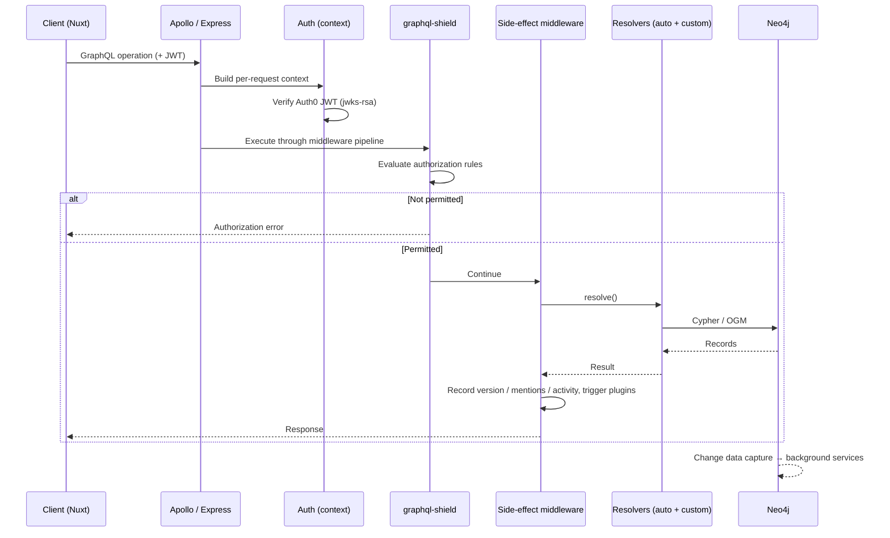

# Architecture

This document describes how the Multiforum backend is structured and the
reasoning behind its main technology choices. For the permission model in
detail, see [permission-system.md](./permission-system.md); for running the
service, see [environment-variables.md](./environment-variables.md).

## Overview

The backend is a [GraphQL](https://graphql.org/) API over a
[Neo4j](https://neo4j.com/) graph database. A request passes through a series of
layers, each responsible for one concern:

| Layer | Responsibility | Where it lives |
| --- | --- | --- |
| Transport | HTTP, GraphQL protocol, error formatting | `index.ts`, `errorHandling.ts` |
| Authentication | Verify the caller's identity | request context, `rules/permission/` |
| Authorization | Decide whether the action is allowed | `permissions.ts`, `rules/` |
| Side effects | Cross-cutting work tied to mutations | `middleware/`, `hooks/` |
| Resolution | Turn GraphQL operations into data | `customResolvers/`, Neo4j GraphQL |
| Persistence | Store and traverse the graph | Neo4j OGM + driver |
| Async work | Notifications, version history | `services/` |

Keeping these concerns in separate layers means each can be read, changed, and
tested on its own — authorization rules without touching resolvers, resolvers
without touching the HTTP layer, side effects without touching either.

## Request lifecycle



## Layers in detail

### Transport — Apollo Server on Express

[`index.ts`](../index.ts) wires an [Apollo Server](https://www.apollographql.com/docs/apollo-server/)
into an Express app. Two Apollo plugins are registered: the standard HTTP-drain
plugin for graceful shutdown, and a project error-handling plugin
([`errorHandling.ts`](../errorHandling.ts)) that formats GraphQL errors
consistently, enriches them for debugging in development, redacts sensitive
fields, and flags critical errors for monitoring.

### Authentication — Auth0

Each request carries an Auth0-issued JWT. The token is verified against Auth0's
signing keys ([jwks-rsa](https://github.com/auth0/node-jwks-rsa) +
[jsonwebtoken](https://github.com/auth0/node-jsonwebtoken)) when the per-request
context is built, establishing *who* the caller is. The caller's roles and
permissions are loaded lazily — only when an authorization rule needs them — so
unauthenticated and public operations pay no database cost.

### Authorization — graphql-shield

Authorization is a dedicated layer, not logic sprinkled through resolvers. It is
expressed as [graphql-shield](https://www.npmjs.com/package/graphql-shield) rules in
[`permissions.ts`](../permissions.ts) and [`rules/`](../rules), applied to the
schema as middleware so a denied request never reaches a resolver.

The permission model is role-based across two scopes (server-wide and
per-channel) and two audiences (regular users and moderators), with suspension
handling and server-level fallbacks. Rules are composed from small, focused
pieces, and the pure decision in each rule (for example, *given these fetched
roles, is this permission granted?*) is separated from the data fetching so it
can be unit-tested directly. See [permission-system.md](./permission-system.md).

### Resolution — Neo4j GraphQL + custom resolvers

The executable schema is produced by the
[Neo4j GraphQL library](https://neo4j.com/docs/graphql/current/) from a single
set of type definitions ([`typeDefs.ts`](../typeDefs.ts)). For the majority of
the API — CRUD, filtering, ordering, pagination, and nested relationship
resolution — the library generates resolvers directly from the schema, so that
behavior is defined declaratively rather than written by hand.

Operations that need genuinely custom behavior (multi-step transactions,
hand-tuned Cypher, cross-entity workflows) are implemented as custom resolvers,
organized by domain under [`customResolvers/`](../customResolvers) with their
Cypher kept in dedicated `.cypher` files. These use the
[OGM](https://neo4j.com/docs/graphql/current/ogm/) for typed, programmatic graph
access. A single composition root assembles the type, query, and mutation
resolvers from per-concern builders.

### Side effects — middleware and hooks

Work that must happen alongside a mutation but is not part of its core result is
handled in the [`middleware/`](../middleware) pipeline and
[`hooks/`](../hooks): version history snapshots, @-mention extraction, issue
activity feeds, the plugin pipeline, and channel bots. Isolating these as
separate middleware keeps resolvers focused on their own job and makes each side
effect independently changeable.

### Async work — event-driven background services

Latency-sensitive callers should not wait on email or history bookkeeping. The
Neo4j GraphQL library's subscriptions are enabled as a change-data-capture
stream that feeds [`services/`](../services): notification delivery and
version-history services react to data changes out of band, off the request
path.

### Extensibility — the plugin system

Server- and channel-level [plugins](../PLUGIN_REQUIREMENTS.md) extend behavior
without changing the core. Events (a new comment, a new download, channel
changes) flow through configurable pipelines that invoke plugins in order, with
per-step conditions and failure handling. New capabilities are added by
installing a plugin rather than editing the application.

## Data model: why a graph

A forum is dense with relationships: comments thread into replies, users belong
to channels, channels grant roles, content accrues votes and reports, and
moderation spans both server and channel scope. A graph database stores these
relationships as first-class, directly traversable edges:

```cypher
(:User)-[:AUTHORED_COMMENT]->(:Comment)-[:POSTED_IN_CHANNEL]->(:Channel)
(:User)-[:UPVOTED_COMMENT]->(:Comment)
(:Comment)-[:IS_REPLY_TO]->(:Comment)
(:Channel)-[:HAS_MOD_ROLE]->(:ModChannelRole)
```

(These are real relationship types from the schema.)

Traversals such as "the parent chain of a comment", "the moderators who govern a
channel", or "a user's contributions across channels" are local graph walks
rather than recursive joins across many tables. The relational shape of the
domain maps onto the storage model instead of fighting it.

## Reliability and developer experience

- **End-to-end types.** The codebase is TypeScript in strict mode. GraphQL and
  OGM types are generated from the schema, so the API contract and the code that
  implements it cannot silently drift apart. Type generation runs from
  `typeDefs.ts` with no database or running server required, so a clean checkout
  builds deterministically.
- **Tested against a real database.** Unit tests run on Node's built-in test
  runner; integration tests in [`tests/integration/`](../tests/integration) run
  against a real Neo4j instance provisioned by
  [Testcontainers](https://testcontainers.com/), so the actual Cypher and
  transactions are exercised — not a mock. Coverage is tracked; see
  [coverage-baseline.md](./coverage-baseline.md).
- **Continuous integration.** Every change is type-checked, unit- and
  integration-tested with coverage, and built before merge.
- **Observability.** A structured, leveled logger replaces ad-hoc logging, and
  GraphQL errors pass through one centralized formatter.
- **Neo4j session routing — reads stay leader-routed on purpose.** Custom
  resolvers open sessions with the driver's default access mode. On a causal
  cluster that routes every query to the leader (and it is a no-op on the
  single-instance deployment used today). This is deliberate: the leader is
  always current, so it guarantees *read-your-own-writes* — a user who performs a
  mutation and immediately loads a follow-up query (their new comment, the
  channel feed, etc.) sees their own change. **Do not** switch reads to `READ`
  sessions (replicas) as a blanket optimization: this codebase does not capture
  or forward Neo4j **bookmarks**, so a follow-up read could land on a lagging
  follower and miss the just-written data — an intermittent read-your-own-writes
  regression that is invisible on a single instance and only appears once a
  cluster exists. Offloading reads to replicas is a deliberate cluster-migration
  workstream (end-to-end bookmark propagation plus a per-query decision on which
  reads may tolerate staleness — search/analytics may, user-facing follow-ups
  may not), and it applies system-wide, including Neo4jGraphQL's auto-generated
  read resolvers — not a default to flip on per query.

## Repository map

| Path | Contents |
| --- | --- |
| [`index.ts`](../index.ts) | Server bootstrap: schema assembly, middleware, Apollo/Express |
| [`typeDefs.ts`](../typeDefs.ts) | GraphQL schema definition |
| [`customResolvers/`](../customResolvers) | Custom queries, mutations, field resolvers, and Cypher |
| [`permissions.ts`](../permissions.ts), [`rules/`](../rules) | Authorization rules (graphql-shield) |
| [`middleware/`](../middleware), [`hooks/`](../hooks) | Mutation side effects |
| [`services/`](../services) | Background services and the plugin runtime |
| [`tests/`](../tests) | Unit and Testcontainers-backed integration tests |
| [`docs/`](.) | This documentation |
