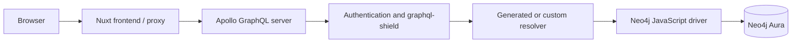
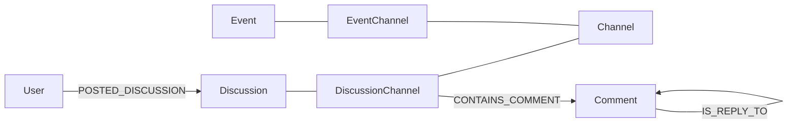

# Neo4j Performance: Newcomer Overview

This document is the starting point for developers who are new to Multiforum,
Neo4j, or both. It explains how database performance fits into the application,
why the app was slow even with little data, and the design rules the backend now
uses.

For the chronological story and before/after measurements, read
[Neo4j performance history](./neo4j-performance-history.md). For hands-on query
work, use the [query performance guide](./neo4j-query-performance-guide.md).
The [performance roadmap](./performance-roadmap.md) records the current state
and remaining work.

## The short version

Multiforum stores a relationship-heavy forum in Neo4j and exposes it through
GraphQL. That is a natural fit for the domain, but it creates one important
performance risk: a short GraphQL operation can be translated into a very large
Cypher query that joins many growing collections.

The major performance problems found in 2026 were not caused by a large
database. They were caused by asking Neo4j to do too much work before returning
a small page:

- planning enormous generated queries;
- multiplying rows while joining votes, comments, tags, images, files, and
  roles;
- collecting or hydrating every matching item before applying a page limit;
- scanning labels where an indexed lookup was possible;
- returning whole relationship collections when the UI needed only a count or
  the current viewer's state;
- using offset pagination and unbounded collection reads.

The recurring solution is:

> **Start from a selective indexed node, choose a small page, and only then
> load the display data for that page.**

In plain terms: find the twenty books you need before taking books off every
shelf.

## Where Neo4j sits in a request



A slow page is not automatically a slow database query. Time can be spent in
the browser, network/proxy, GraphQL parsing and validation, authorization,
Cypher planning, Cypher execution, or serial database round trips.

The backend instruments these layers in
[`services/requestTiming.ts`](../services/requestTiming.ts). Every GraphQL
response carries a `Server-Timing` header with queue, parse, validate, execute,
and summed database time. The server also records database call count and
event-loop delay. Start there before changing a query.

## The graph model in one picture

The central content objects are connected to a channel through intermediary
nodes:



`DiscussionChannel` and `EventChannel` are not accidental join records. They
hold channel-specific state such as votes, archive/lock status, labels, and
ranking information. This is a sensible graph-modeling pattern: the connection
between content and a channel has identity and properties of its own.

The 2026 audit found malformed legacy connector nodes, not a fundamentally bad
model. The cleanup and lifecycle protections are described in
[neo4j-intermediate-node-cleanup.md](./neo4j-intermediate-node-cleanup.md) and
[neo4j-identity-invariants.md](./neo4j-identity-invariants.md).

## Three ways the application queries Neo4j

### 1. Neo4j GraphQL-generated resolvers

[`typeDefs.ts`](../typeDefs.ts) defines node types and relationships. The
Neo4j GraphQL library generates much of the CRUD/filtering Cypher.

This is convenient and type-safe, but a deeply nested GraphQL selection can
produce a large statement with significant planning and row-expansion cost.
Generated Cypher is not inherently slow; it is simply important to inspect the
query shape when an operation joins several growing lists.

### 2. The OGM

The Neo4j GraphQL OGM provides programmatic model access for server-side code.
It shares the schema and driver but bypasses GraphQL authorization, so callers
must enforce authorization themselves. Broad OGM selection sets can have the
same generated-query cost as broad GraphQL operations.

### 3. Purpose-built custom Cypher

Hot or complex reads use resolvers in [`customResolvers/`](../customResolvers)
and `.cypher` files in [`customResolvers/cypher/`](../customResolvers/cypher).
These queries return only the fields the frontend uses, can page before
hydrating, and can be profiled independently.

Custom Cypher is not automatically better. It is chosen when it makes the
amount of work explicit and bounded. Small, ordinary CRUD operations should
continue to use generated resolvers where they remain clear and fast.

## The mental model: rows multiply

Suppose one discussion has:

- 10 voters;
- 8 comments;
- 4 tags;
- 3 images.

A naive chain of independent `OPTIONAL MATCH` clauses can temporarily produce
`10 × 8 × 4 × 3 = 960` rows for one discussion. The query may eventually use
`collect(DISTINCT ...)` and return one neat object, but Neo4j still created,
carried, and deduplicated the intermediate rows.

This is why a query returning two cards can be expensive.

The improved pattern isolates each growing relationship in a scoped subquery:

```cypher
MATCH (discussion:Discussion {id: $discussionId})

CALL {
  WITH discussion
  MATCH (discussion)-[:HAS_TAG]->(tag:Tag)
  RETURN collect(tag.text) AS tags
}

CALL {
  WITH discussion
  MATCH (discussion)<-[:POSTED_IN_CHANNEL]-(entry:DiscussionChannel)
  RETURN count(entry) AS channelCount
}

RETURN discussion.id AS id, tags, channelCount
```

Each subquery returns one row before the next collection is considered. In
plain terms, it makes several small shopping lists instead of repeatedly
copying one giant combined list.

## The current query design rules

### Anchor selectively

Begin from a property backed by a uniqueness constraint or index whenever
possible. A `NodeUniqueIndexSeek` or `NodeIndexSeek` means Neo4j can jump to the
starting node. A label scan means it is checking every node of that type.

Example: the forum discussion list filters by
`DiscussionChannel.channelUniqueName`, so it needs an index beginning with that
property. The composite key `(discussionId, channelUniqueName)` cannot help a
query that knows only `channelUniqueName`.

### Select, then hydrate

Ranking and filtering should first return a small ordered set of IDs. A second
query hydrates only those IDs with authors, tags, votes, images, files, and
other display data.

One larger database round trip is not always faster. A huge generated statement
may take longer to plan and may multiply far more rows than two focused
statements in one transaction.

### Bound every growing collection

Public list sizes have server-side defaults and hard limits. Detail pages load
small first pages of answers, images, and files. Comments and replies are paged.

This makes work proportional to the requested page size instead of the total
lifetime size of a discussion.

### Prefer cursor pagination on primary feeds

Offset pagination says “sort everything, then walk past the first 1,000 rows.”
Cursor pagination says “continue after this known `(score/date, id)` pair.”
Later cursor pages therefore do not become slower merely because they are deep.

Stable ordering always includes a unique tie-breaker, usually `id`, so equal
timestamps or scores do not create gaps or duplicates.

### Ask for counts and viewer state, not whole populations

To display “42 votes” and whether Alice voted, the server should return a count
plus Alice's state. It should not load all 42 voter profiles. The same rule
applies to subscriptions and similar relationship collections.

### Use full-text indexes for text search

A leading-wildcard regular expression checks every title/body. Full-text search
uses an index to produce a small candidate set, after which normal visibility
and channel filters apply.

### Materialize expensive security predicates carefully

Age-gate visibility once required repeating relationship traversals inside many
generated queries. The result is now stored as a property and kept current by
write-time reconciliation. Reads become a cheap property check. This is a
deliberate denormalization: writes do a little more work so every read does much
less.

The correctness design is documented in
[age-gate-materialization-design.md](./age-gate-materialization-design.md).

## Project-specific constraints

- The codebase and integration suite target Neo4j 5-compatible Cypher. It uses
  `@neo4j/graphql` 5.12.x, the discontinued OGM 5.12.x, and JavaScript driver
  5.28.x. Do not copy Cypher 25 or GraphQL v7 syntax into this codebase without
  a migration. See backend
  [issue #284](https://github.com/gennit-project/multiforum-backend/issues/284).
- All sessions name `NEO4J_DATABASE`; omitting it causes an extra home-database
  discovery round trip.
- Reads stay leader-routed intentionally. Reader routing without bookmark
  propagation can violate read-your-own-writes. See
  [architecture.md](./architecture.md#reliability-and-developer-experience) and
  [issue #305](https://github.com/gennit-project/multiforum-backend/issues/305).
- Explicit sessions must close in `finally`.
- Managed transaction callbacks may retry. Do not send email, call HTTP APIs,
  or perform storage side effects inside them.

## Where to look in the repository

| Concern                       | Location                                                            |
| ----------------------------- | ------------------------------------------------------------------- |
| Schema and generated behavior | [`typeDefs.ts`](../typeDefs.ts)                                     |
| Custom resolver composition   | [`customResolvers/`](../customResolvers)                            |
| Hand-written Cypher           | [`customResolvers/cypher/`](../customResolvers/cypher)              |
| Database/session defaults     | [`services/neo4jDatabase.ts`](../services/neo4jDatabase.ts)         |
| Driver liveness settings      | [`services/neo4jDriverConfig.ts`](../services/neo4jDriverConfig.ts) |
| Schema/integrity audit        | [`services/neo4jSchemaAudit.ts`](../services/neo4jSchemaAudit.ts)   |
| Request timing                | [`services/requestTiming.ts`](../services/requestTiming.ts)         |
| Pagination validation         | [`services/pagination.ts`](../services/pagination.ts)               |
| Real-Neo4j tests              | [`tests/integration/`](../tests/integration)                        |

## A useful first hour

1. Read this overview and [architecture.md](./architecture.md).
2. Follow one GraphQL operation from the frontend document to `typeDefs.ts`,
   then to its resolver and Cypher file.
3. Run the unit tests and one relevant integration file.
4. Run `pnpm run neo4j:audit` against a disposable/local database or an
   explicitly authorized environment.
5. Read an `EXPLAIN` plan bottom-up and identify its starting operator.
6. Compare one page-selection query with its hydration query.

When changing a query, follow the
[query performance guide](./neo4j-query-performance-guide.md), record the
before/after evidence, and preserve result-equivalence tests.
