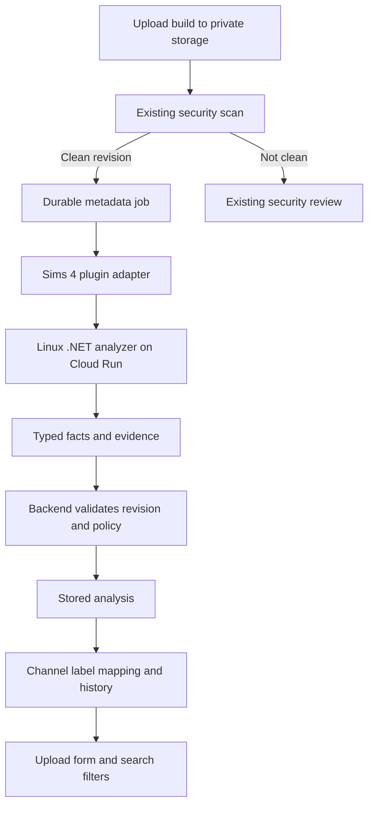

# Proposal: Sims 4 build auto-labeler

Status: proposed; metadata portability spike completed September 30, 2026. Pack and CC dependency interpretation remains under investigation. See the [spike report and reproduction instructions](../spikes/sims4-metadata/README.md).

## Recommendation

Build a `sims4-build-metadata` plugin that sends uploaded build files to an isolated analysis service and returns structured facts. Let the backend translate those facts into each forum's labels. Automatically fill supported fields, show where they came from, and preserve explicit creator or moderator corrections.

**Windows is not needed for the metadata analyzer.** The spike read the supplied lot files headlessly on macOS and Linux with identical results. Use a Linux .NET service on Cloud Run alongside the existing Google Cloud storage integration. No Windows worker, desktop automation, or running game is required for this step. Full blueprint/resource dependency resolution is a later capability whose portability has not yet been tested.

The first useful release should read lot dimensions and the build's recorded metadata. Treat complete pack dependency verification and proof of “no CC” as separate, harder capabilities. A partial answer with an honest explanation is better than an incorrect filtering label.

## What is already available

This proposal is grounded in the current backend checkout:

| Existing capability | Reuse and limitation |
| --- | --- |
| Download plugin events | `downloadableFile.created` and `.updated` exist in [constants](../services/plugin/constants.ts). Use these; do not analyze on every download. |
| External plugin execution | [downloadTrigger](../services/plugin/downloadTrigger.ts) loads a JavaScript plugin and awaits `handleEvent`. It supplies settings, decrypted server secrets, execution IDs, diagnostics, and attachment URLs. The binary parser belongs outside that process. |
| Private file access | [Private download storage](./private-download-storage.md) already supplies five-minute signed reads without persisting those URLs in run payloads. Queue messages must contain stable object identities, with a fresh read URL issued when work starts. |
| Security scanning | `security-attachment-scan` results become `scanStatus`; [prepareDownload](../customResolvers/mutations/prepareDownload.ts) checks the scan before releasing a download. Metadata analysis must have independent status and must never mark a file clean. |
| Search labels | `FilterGroup`, `FilterOption`, and `DiscussionChannel.LabelOptions` already support channel-specific labels. Labels belong to a discussion's submission in a channel, while analysis belongs to a particular file revision. |
| Label editing and history | [updateDownloadLabels](../customResolvers/mutations/updateDownloadLabels.ts) supports human edits and history. It currently takes the complete label list; automatic updates need a narrower, concurrency-safe path. |
| Operations | Plugin versions, settings, secrets, run diagnostics, execution leases, reruns, and campaign machinery already exist. Use [declarative configuration](./plugin-configuration-reconciliation.md) for repeatable installation. |

Labeling failure should leave metadata incomplete, rather than delete a build or block an otherwise clean download. Keep metadata analysis separate from the existing attachment security decision.

## Feasibility: what the files actually tell us

Sims 4 lots are distributed as a group of tray files, including `.trayitem`, `.blueprint`, and `.bpi` files. The Sims Resource's own upload guide documents that grouping and explains that its service can associate its own CC automatically. This is evidence that file-based assistance is practical, but not evidence that every external CC dependency can be resolved. [TSR upload guide](https://thesimsresource.zendesk.com/hc/en-us/articles/31357208841491-Finding-the-Content-You-Used-in-Your-Lots-Rooms-and-Sims)

The spike uses [LlamaLogic](https://github.com/Llama-Logic/LlamaLogic)'s MIT-licensed [protobuf package 1.126.58](https://www.nuget.org/packages/LlamaLogic.Protobuf/1.126.58), pinned with NuGet lockfiles. The working CLI reads loose tray files, ZIPs, and one nested ZIP level without a game installation or desktop application.

Its [Exchange schema](https://github.com/Llama-Logic/LlamaLogic/blob/58e103b92cee0f90224f81c86f44747cd7da14d1/LlamaLogic.Protobuf/Protos/Exchange.proto) includes blueprint dimensions, venue, value, bedroom/bathroom metadata, modded-content flags, and pack-related identifiers. The spike verified framing against the supplied exports and tested preservation of optional-field absence. Broader version compatibility and the meaning of pack encodings still need validation. Absent fields remain unknown rather than becoming authoritative zero/false values.

### Completed spike findings

- Seven loose tray files and six outer ZIPs yielded **13 records representing six distinct tray-file hashes**. All result fields matched on macOS and Linux, and ZIP copies matched their loose counterparts.
- **13 regression tests passed on each platform**, with 84.9% line coverage and 88.5% branch coverage. The real files also exercised the CLI on both platforms.
- Four distinct lots explicitly record `is_modded_content = true`, despite the creator's no-CC expectation. Independent wire-level inspection confirmed those encoded values. The cause is unresolved; the flag must not become an automatic claim that CC is required.
- `Havisham_House` contains the same tray metadata as Salty Paws Saloon. Use file contents and identity for labeling, and surface filename/content conflicts for review.
- The Bedlington archive contains a nested ZIP; the archives also contain Mac sidecars. Support that bounded nesting case and ignore sidecars instead of parsing them as game data.
- Raw pack-related fields were extracted, but their mapping to named packs and the expected Cats & Dogs requirement are **not yet verified**. The spike reports dependency assessment as `UNVERIFIED`.

This establishes portable metadata extraction for the supplied files, not independent verification of their dimensions in-game, complete pack/CC dependencies, or support for every game version. The report contains the per-lot results and test limits.

| Field | Initial behavior | What must be validated |
| --- | --- | --- |
| Lot size | Auto-apply after comparison with in-game ground truth | Extraction of both dimensions is proven on the supplied files; preserve orientation in raw data and map to the forum's canonical size convention. |
| Lot/venue type | Auto-apply known mappings | Unknown or custom venue IDs remain unknown. |
| Packs recorded by the build | Keep raw identifiers internal until mapping is validated; then apply known positive matches with “recorded by file” provenance | Extraction is proven, but pack meanings are not. Validate the encodings and maintain a versioned catalog. An unknown ID makes completeness unknown. |
| Packs needed to reproduce the build | Initially partial/unverified | Recorded packs, referenced resources, custom venues, and CC dependencies may differ. A usable build with missing objects is not the same as an exact reproduction. |
| CC status | Show “file marked as modded,” “file not marked as modded,” or “unknown”; report conflicts with creator declarations | The fixtures demonstrate disagreement with a no-CC expectation. Neither true nor false alone proves CC requirements. |
| CC download links | Leave to the creator initially | Resource identifiers need a trusted catalog to resolve names, creators, links, meshes, and dependencies. Never guess links. |
| Bedrooms, bathrooms, price | Optional recorded metadata | Exported values may be stale or entered by a creator; do not call them independently verified. |

Keep `hasBundledPackages`, `fileMarkedModded`, and `dependencyAssessment` separate. A zip can include unused CC; a lot can require CC without including its packages. Unknown resources can also mean a new game patch, an incomplete official catalog, or corruption.

For the first release, do not auto-assign absolute “CC-free” or “base game only” labels. Offer weaker labels such as “No CC flagged in file” only if the forum wants that distinction. Preserve existing creator declarations as declarations, not verified facts. Later, enable stronger claims only for parser/catalog versions whose coverage has been demonstrated.

## User experience

After upload, show “Reading build details…” while the author writes the description. Once analysis finishes, populate supported fields and show a compact explanation:

> Lot size: 30×20 · Read from build file
>
> Packs: Not yet verified
>
> CC: File marked as modded · CC requirements not verified

Creators should not have to approve each reliable field. They can correct a value, keep their current value when it conflicts, or request another analysis. A correction records an override so the next run does not silently undo it. Moderators can resolve disputes with the same history visible.

Publication remains possible when analysis is unavailable; fields stay manual or unknown. Security policy continues independently. Show unsupported archives and missing tray files as actionable messages, not a generic “plugin failed.”

Start with one lot per ZIP, allowing subdirectories, optional images, and at most one nested ZIP level under strict size/entry limits. Ignore `__MACOSX` and AppleDouble `._` sidecars. Validate grouping by identifiers and content, not filenames or timestamps alone. If there are multiple builds, mixed room/household content, or ambiguous groups, report that auto-labeling needs one build per upload. Do not union pack lists and sizes across alternative versions. Add explicit build selection and per-variant metadata later.

## Architecture and runtime choice



Analyze once per immutable file revision; map the result independently into every opted-in channel. In particular, do not use the first `DiscussionChannel` selected by today's download runner as the complete list of destinations.

**Chosen architecture: a Linux .NET service on Cloud Run.** The successful Debian Linux execution removes the Windows hosting requirement for metadata extraction. The service boundary remains useful for isolating file parsing, controlling resource usage, and deploying parser updates independently of the backend.

Cloud Run supports Linux executables; build the deployment image for its supported architecture and validate it in a staging deployment. The spike used an x64 Linux SDK container, not a deployed Cloud Run service. Choose a supported production .NET runtime and a minimal runtime image when implementing the service rather than shipping the spike's SDK image. [Cloud Run runtime contract](https://docs.cloud.google.com/run/docs/container-contract)

Windows hosting alternatives are outside the metadata MVP. Evaluate any later resource-resolution dependencies on Linux as they are introduced; the completed spike does not claim to have implemented or tested that separate capability.

## Execution and integration changes

The diagram describes proposed functionality, not a queue that already exists. Today's `handleEvent` path awaits completion in the backend process; leases and a watchdog do not make an in-memory invocation durable.

The completed spike is a standalone CLI with no plugin or service integration. A bounded HTTP call from the plugin can exercise the next service prototype. Before public rollout, add a durable metadata-job dispatcher with a transactionally recorded job/outbox and an independently running executor. The upload request commits the file and returns; it does not wait for analysis.

1. Record an analysis request for the committed file revision. Dispatch only after a clean security verdict for that same revision. Security failure leaves analysis blocked; a later clean rescan makes it eligible.
2. The executor claims a job, obtains a fresh signed read for its pinned storage object generation, and invokes the plugin adapter. The adapter calls the analyzer with a strict timeout.
3. Persist validated facts and conditionally apply labels only if the revision, run lease, channel policy, and override versions still match. Commit result, label changes, and audit history atomically.
4. Retry transient failures with bounded backoff; move repeatedly failing jobs to a terminal state with a user-visible rerun action. A reconciler recovers committed-but-undispatched jobs and expired leases.

Use existing run IDs, diagnostics, and lease conventions where useful. Ensure the executor can recover after process death. Begin with a synchronous analyzer response inside the durable executor; add a remote `202/jobId` protocol only if measured work cannot fit a bounded request. Never treat “job accepted” as “labels complete.”

Metadata jobs must be independent of the download gate. Do not append a slow labeler to the `downloadableFile.downloaded` pipeline. Also do not rely on `PREVIOUS_SUCCEEDED` to mean “clean”: the current runner can regard a completed non-clean security verdict as a successful plugin execution, and writes `scanStatus` after the pipeline loop. Schedule explicitly from the committed security outcome.

Use a server-installed plugin with server-managed service credentials. Make label application an explicit per-channel opt-in with configured mappings. The analyzer receives no database credentials and chooses no `FilterOption` IDs. The backend owns authorization and mapping. Existing JavaScript plugins are trusted code loaded in-process; this design isolates hostile file parsing, not arbitrary installed plugin code.

## Analysis contract and persistence

Add a server-managed `FileAnalysis` record separate from transient plugin logs. The following is an illustrative target response after pack mappings are validated, not the current spike output or an existing API. Until then, store raw pack-related fields with an unknown interpretation and no derived pack labels:

```json
{
  "schemaVersion": 1,
  "analysisId": "analysis-123",
  "downloadableFileId": "file-123",
  "fileRevision": "immutable-object-generation",
  "sha256": "sha256-of-input-bytes",
  "parserVersion": "pinned-release",
  "catalogVersion": "pinned-catalog",
  "outcome": "PARTIAL",
  "builds": [{
    "itemId": "tray-item-id",
    "kind": "LOT",
    "lotSize": {
      "value": { "x": 30, "z": 20 },
      "basis": "FILE_METADATA",
      "state": "KNOWN"
    },
    "recordedPacks": {
      "ids": ["EP01"],
      "state": "PARTIAL",
      "unknownRawIds": ["unmapped-id"]
    },
    "cc": {
      "fileMarkedModded": true,
      "hasBundledPackages": false,
      "dependencyAssessment": "UNVERIFIED"
    }
  }],
  "diagnostics": [{ "code": "UNKNOWN_PACK_ID" }]
}
```

Retain evidence locations, parsing warnings, timestamps, plugin/run identity, and mapping-policy version alongside facts. Use explicit field states such as `KNOWN`, `PARTIAL`, `UNKNOWN`, and `CONFLICT`; avoid invented confidence percentages. Terminal outcomes distinguish complete, partial, unsupported, and failed analysis. An unsupported game version is not an empty set of dependencies.

Pin storage generations and add a durable revision identity: the current schema has storage paths but no explicit generation/content hash fields. Bind analysis and security decisions to the same bytes. Validate returned identities against the job; do not trust them simply because they appear in JSON. Represent large game IDs as strings to avoid JavaScript integer precision loss.

Cache within the deployment by `(content hash, parser version, catalog version, analysis options)`. Mapping changes can reuse facts; parser/catalog changes require reanalysis. Authorize access through the current file even on cache hits. The worker cannot reuse another uploader's result to expose private metadata.

## Label ownership, overrides, and filtering

Store provenance for each automated assignment: analysis ID, field, source file revision, channel policy, and whether a human has overridden it. Extend label history to identify the plugin as actor rather than inventing a user account.

Automatic application may update only mapped groups and only the assignments it owns. Preserve unrelated style/theme labels. Removing a detected label counts as an explicit suppression, so reruns do not re-add it. A fresh upload invalidates the old analysis immediately; keep prior facts for history but remove their current verified status. Notify the creator to review overrides on the new revision rather than silently converting them into new facts.

Mapping configuration uses stable group keys and canonical values, resolving to options belonging to the target channel. Validate uniqueness and reject ambiguous mappings. Missing options produce diagnostics; the worker must not create new public taxonomy entries automatically. Cross-posting into a new channel applies that channel's policy to the current facts without re-parsing the file.

Search semantics need special attention. “Does not require Pack X” cannot mean “has no Pack X label,” because an unanalyzed or partially analyzed build would pass. Store per-group completeness and expose it to queries. For dependency compatibility filters, require a complete assessment and a required-pack set that is a subset of the user's owned packs. Give users an explicit choice to include unverified builds. Exact size matching can work independently when lot size is known but dependencies are not.

## Isolation and operational limits

Treat archives as untrusted input even after a clean malware scan. Use a maintained extractor, reject traversal/absolute paths and links, enforce limits on expanded bytes, entry count, nesting, memory, and execution time, and clean temporary files after every attempt. Do not execute uploaded scripts or binaries. Ignore optional images for metadata parsing. Defer password-protected archives, RAR, and 7z until separately supported.

Allow reads only from approved storage locations; do not fetch arbitrary URLs found inside the archive or follow redirects into private networks. Restrict analyzer network access, use authenticated service requests, and keep signed URLs and user file contents out of logs. Persist only the facts needed for labels and diagnostics, with authorization matching the source discussion's visibility and age restrictions.

A low-volume pilot should cap worker concurrency and retries. Measure queue delay, analysis time, memory, cache hit rate, failures by game/parser version, partial-result rate, and override/disagreement rate. Cost is Cloud Run runtime, storage operations, transfer, and maintenance; quote a dollar estimate only after fixture benchmarks and expected upload volume are known.

## Delivery plan and acceptance criteria

### 1. Metadata portability spike — completed; semantic validation next

Completed: a pinned, reproducible CLI reads actual tray files and ZIPs on macOS and Linux, validates observed framing, preserves optional-field presence, and passes the regression suite. The [spike report](../spikes/sims4-metadata/README.md) records the findings. Linux is the selected host platform; another Windows feasibility test is not a prerequisite.

Next, compare dimensions and pack lists against the game or a trusted desktop tool. Expand the approved fixtures to controlled pack combinations, current kits, CC added/removed, bundled but unused CC, custom venues, and newer exports. Investigate the existing no-CC/modded-flag disagreement. Determine the pack encodings, validate matching blueprint/BPI sets, and establish supported game versions. No backend label writes in this stage.

Exit decision: a tested field-support matrix for automatic application. If only dimensions are dependable, ship that useful subset on Linux and leave dependency claims manual.

### 2. Shadow-mode integration

Add revision tracking, durable dispatch, typed result validation, `FileAnalysis`, and safe diagnostics. Run for one opted-in Sims channel without changing labels. Test restarts, duplicate deliveries, stale results after replacement/deletion, and signed-URL expiration. Compare proposed labels to human labels and investigate disagreements.

### 3. Automatic supported labels

Add channel mappings, assignment provenance, overrides, transactional history, and upload-form feedback. Enable lot size and other validated fields first. Add recorded-pack labels only with clear semantics. Add completeness-aware filtering before presenting negative compatibility claims.

### 4. Broader dependency resolution

Evaluate a maintained resource-to-pack catalog and trusted CC catalogs, then expand to complete dependency claims only where evidence supports them. Add multiple-build archives, rooms, and households as separate scopes. Backfill older uploads gradually after measuring load; reuse campaign controls where compatible with the new job lifecycle.

Acceptance requires correct expected outputs on the approved fixtures; no automatic “CC-free”/“base game only” result from missing data; no stale or duplicate label writes; preservation of overrides; no cross-channel label contamination; and clean downloads remaining usable when labeling fails. Verify that unknown dependencies cannot pass strict compatibility filters. Target at least 80% coverage for new code, with meaningful parser fixtures, job recovery tests, and authorization/concurrency integration tests.

Roll back by disabling automatic application and dispatch while retaining human labels and audit history. A bad parser release can be pinned back, affected assignments identified by provenance, and reanalysis scheduled without deleting downloads.

## Remaining decisions

Windows is not needed for the metadata MVP; headless Linux parsing is demonstrated. The remaining decisions concern which pack/CC claims the evidence supports, supported game versions and archive limits, and the Cloud Run sizing/timeouts appropriate for the pilot. The largest uncertainty is trustworthy dependency interpretation, not operating-system portability of metadata extraction.
